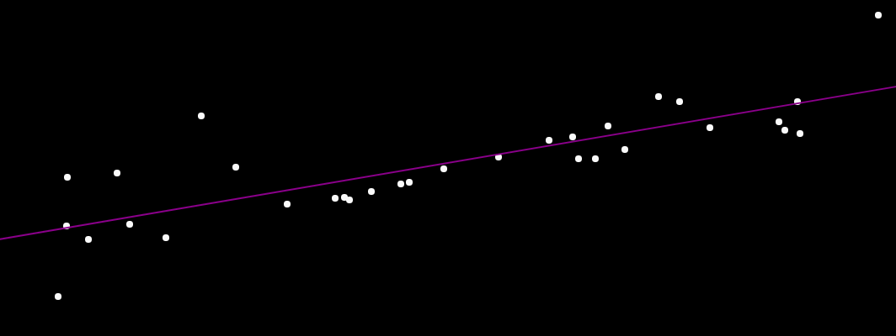

# js-linear-regression

interactive linear regression in the browser

## Overview

Using `TensorFlow.js` and `p5.js`, I created a simple linear regression model (`y = mx + b`). The project is highly interactive as you can add your own data for training. I'm hoping this will be used for educational purposes.

Note: Most of the code here was based off of The Coding Train's [Coding Challenge #104](https://www.youtube.com/watch?v=dLp10CFIvxI).

## References

- [The Coding Train](https://www.youtube.com/channel/UCvjgXvBlbQiydffZU7m1_aw)
- [TensorFlow.js](https://js.tensorflow.org)
- [p5.js](https://p5js.org/)
